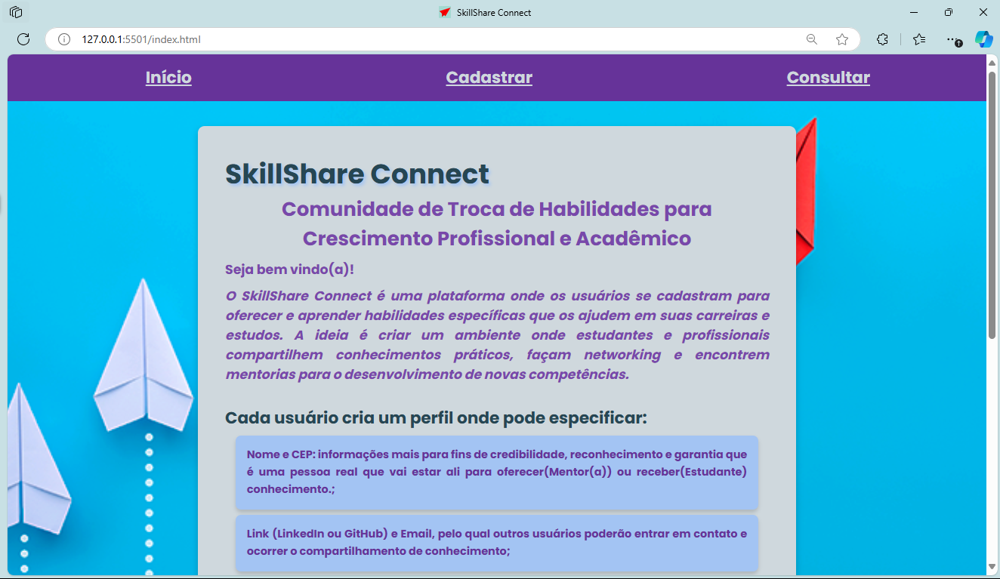
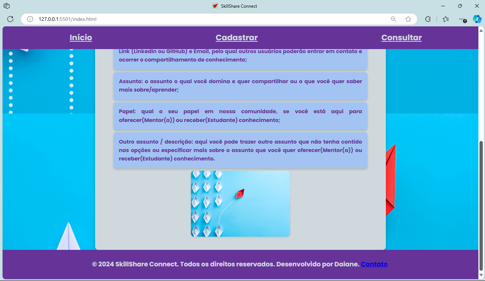
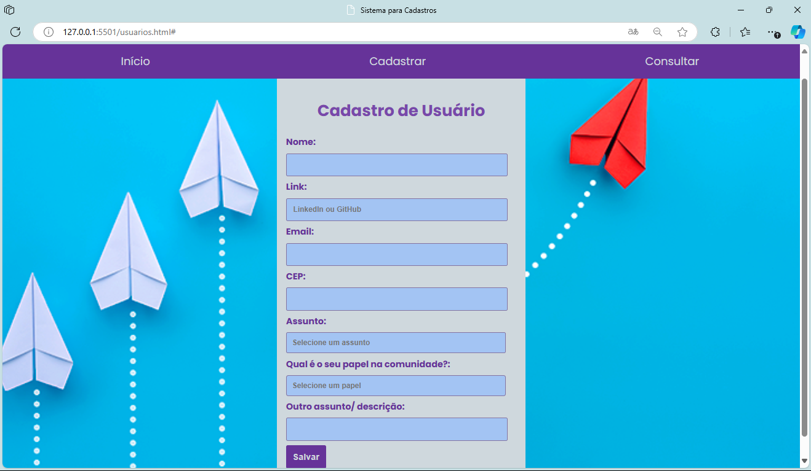
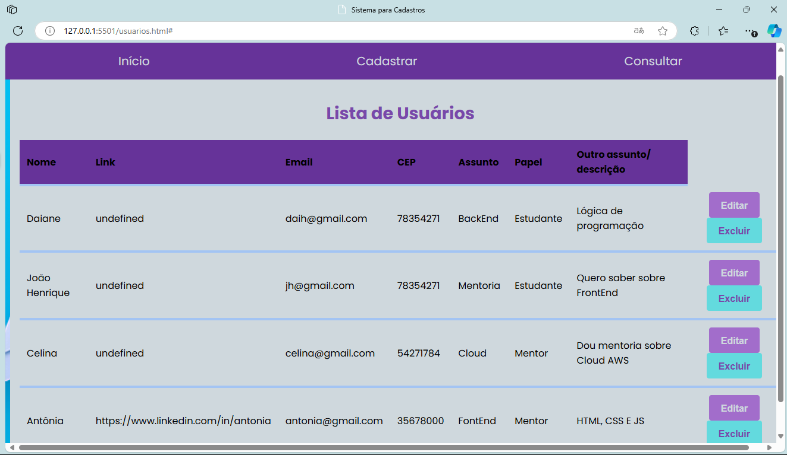
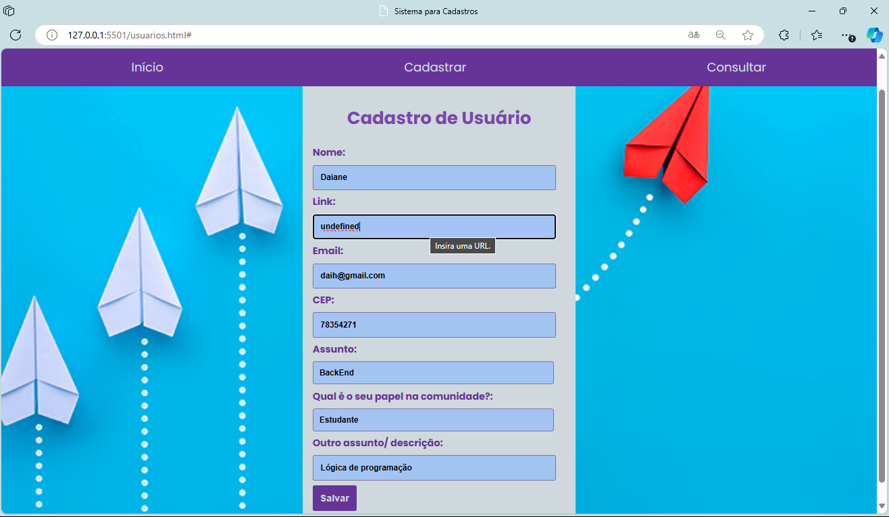
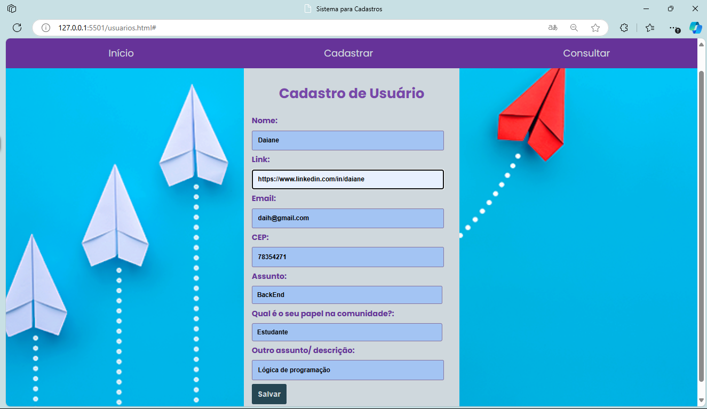
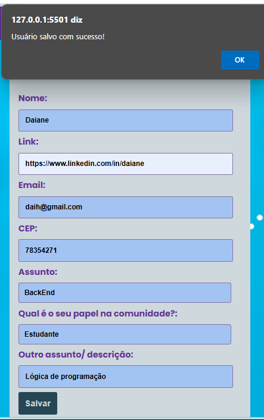
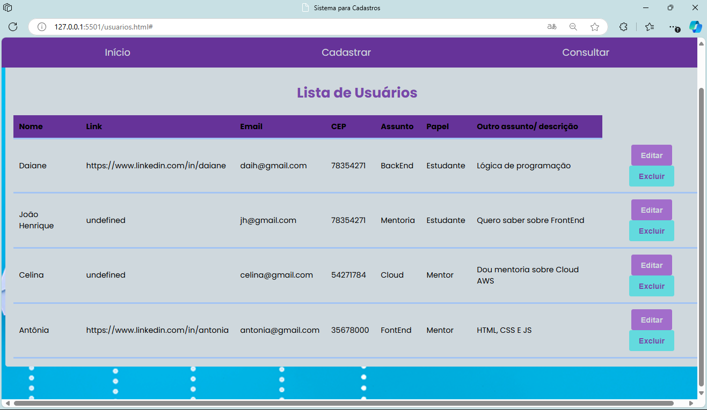
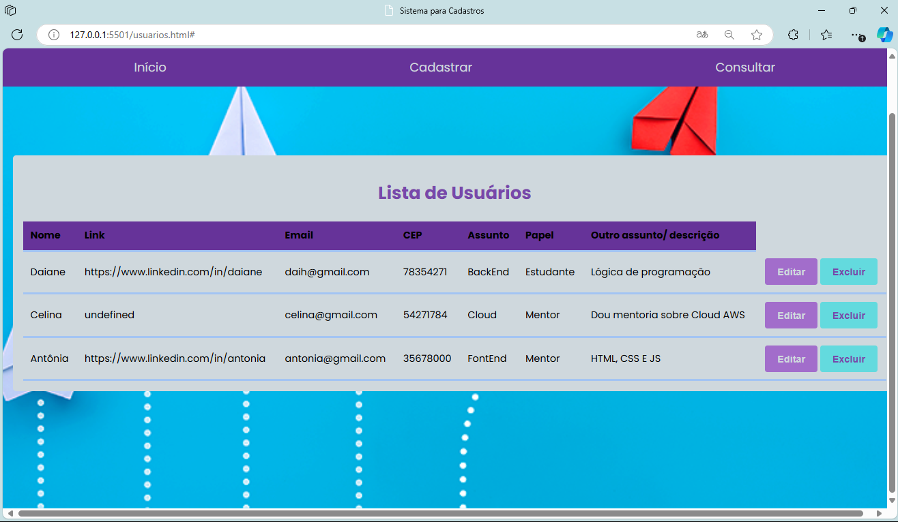

# Seja bem vindo(a)!🚀

# Projeto Sistema para cadastro📚
Esse projeto foi proposto pelo PdA para entrega do miniprojeto do Módulo 2, alguns dos requisitos✔️ :

● Construa um site de cadastro;

● As tecnologias usadas devem ser HTML, CSS &amp; Javascript.

● O site deve conter as opções de:

○ Listar os dados cadastrados;

○ Cadastrar um novo dado;

○ Editar um dado cadastrado;

○ Deletar um dado cadastrado.

● O site não pode ter erros de sintaxe em HTML, CSS e Javascript.

● Deve-se utilizar Arrays, Class & DOM;

● A entrega deve ser realizada através do GitHub;

○ O repositório deve conter 3+ commits.

## Tema escolhido 💡
Resolvi escolher um tema que seja algo que possa auxiliar pessoas e no futuro, com algumas implementações atinja o seu objetivo que é compartilhar conhecimento "SkillShare Connect", aqui a baixo uma explicação do que é e como funciona o site!

# SkillShare Connect 🚀🗺️📚🌐
É uma Comunidade de Troca de Habilidades para Crescimento Profissional e Acadêmico

O SkillShare Connect é uma plataforma onde os usuários se cadastram para oferecer e aprender habilidades específicas que os ajudem em suas carreiras e estudos. A ideia é criar um ambiente onde estudantes e profissionais compartilhem conhecimentos práticos, façam networking e encontrem mentorias para o desenvolvimento de novas competências.

# Tecnologias Usadas 🔧

Este projeto utiliza as seguintes tecnologias:

## HTML

## CSS

## JavaScript

# Como Usar ⚡

Acesse o link do deploy https://daihseven.github.io/Sistema-para-Cadastro/ 

### Página de início

Estará na página de início, a qual contém informações sobre a comunidade e os objetivos.

Na sequência role a página para baixo e vai ter mais algumas funcionalidades que o usuário poderá encontrar.

Depois clique em cadastrar ou consultar(ainda não tera nada).

### Página de cadatro

Atenção: Precisará clicar mais uma vez em cadastro para o formulário aparecer!

O formulário pede para se cadastrar, pedindo os dados:

- Nome;

- Link: LinkedIn ou GitHub;

- E-mail;

- CEP;

- Assunto (deve selecionar um dos assuntos ou outro e depois especificar);

- Qual seu papel na comunidade( se você esta ali para oferecer conhecimento(mentor) ou receber(estudante));

- Outro / descrição: serve para colocar outro assunto e/ou especificar sobre o qual escolheu.

Ao salvar te levará direto para a consulta dos usuários.

Atenção: o formulário possui validação de dados, e não será salvo até todas as informações estarem preenchidas e de acordo com as regras!

### Consultar Lista de Usuários

Atenção: se você entrou direto pela página de início terá que clicar mais uma vez para abrir a consulta, e se entrou automáticamente após o cadastro está tudo okay!

Além de todos os campos do formulário, aqui teremos duas ações, os botões de editar e excluir.

O botão de editar abre o formulário com suas informações, e você poderá editar todas as informações, se alguma estiver com erro, você terá que preencher de acordo com as regras de validação, e assim salvar!

Aqui por exemplo iremos corrigir o endereço do link

Atenção: cadastro realizado antes da inserção do campo link!

Após isso já é possível consultar a lista atualizada!

Agora se quiser excluir um usuário basta clicar em excluir!

Atenção: após exclusão não tem como recuperar os dados excluídos!

### Responsividade

A responsividade é algo essencial em um projeto, ver um site funcionando 100% em qualquer dispositivo e atendendo totalmente aos usuários. Nesse projeto foi implemento algumas responsividade, mas que não atenderam totalmente aos requisitos, em telas menores é possivel visualizar a lista de usuarios rolando para o lado. Estou em busca de aperfeiçoar esta parte, e também aceito dicas de melhoria! 🚀🗺️📚🌐😘

## Links Externos

Caso tenha se interessado pelo projeto e queira buscar mais informações sobre as tecnologias usados, aqui estão alguns links.

- [Documentação do HTML](https://developer.mozilla.org/pt-BR/docs/Web/HTML)
- [Documentação do CSS](https://developer.mozilla.org/pt-BR/docs/Web/CSS)
- [Documentação do JavaScript](https://developer.mozilla.org/pt-BR/docs/Web/JavaScript)
